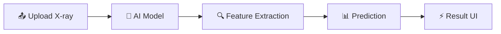

# 🫁 LungAI Diagnostics

<p align="center">
  
</p>

<h3 align="center">
⚡ AI-powered Lung Disease Detection System ⚡
</h3>

<p align="center">
<strong>Fast • Intelligent • Secure</strong>
</p>

---

## ✨ About the Project

> 🚀 A next-generation AI healthcare system that analyzes chest X-rays and delivers **instant, intelligent diagnostics**.

💥 Key capabilities:

* ⚡ Real-time predictions
* 🧠 Deep learning-based analysis
* 🏥 Clinical-level assistance

🎯 Designed for:

* 👨‍⚕️ Doctors
* 🎓 Medical Students
* 🔬 Researchers

---

## 🎬 Live Preview

<p align="center">


</p>

---

## 🚀 Features

### 🌟 Smart & Interactive

* 🧠 AI-powered disease detection
* 📤 Drag & Drop X-ray upload
* ⚡ Instant predictions
* 📊 Advanced visual analytics
* 🔒 Secure authentication (Supabase)
* 🌐 Fully responsive design

---

## 🎯 Output Visualization

💡 Designed to feel like a **real AI medical dashboard**

### 📊 What Users See:

* 🟢 Disease Probability Bar
* 📈 Confidence Score Indicator
* 🔥 Heatmap Visualization (Grad-CAM)
* 📄 Smart Diagnosis Summary

### 🧾 Example Output

```
🫁 Disease: Pneumonia
📊 Confidence: 94.2%
🚦 Risk Level: HIGH
⚡ Status: Completed
```

---

## 🧪 Tech Stack

| Layer       | Technology       |
| ----------- | ---------------- |
| ⚛️ Frontend | React (Vite)     |
| 🟢 Backend  | Supabase         |
| 🤖 AI Model | TensorFlow / CNN |
| 🎨 UI       | Tailwind CSS     |

---

## 🧠 How It Works



---

## ⚙️ Installation

```bash
npm install
npm run dev
```

---

## 🔥 Future Enhancements

* 🧠 Multi-disease detection
* 📱 Mobile app version
* ☁️ Cloud deployment
* 🧬 Patient history integration
* 📡 Real-time doctor consultation

---

## 🌟 Project Highlights

✨ Modern UI/UX
⚡ Real-time AI processing
🧠 Intelligent predictions
🔐 Secure & scalable

---

## ⭐ Support

If you like this project:

🌟 Star the repo
🍴 Fork it
🚀 Share it

---

<h3 align="center">


